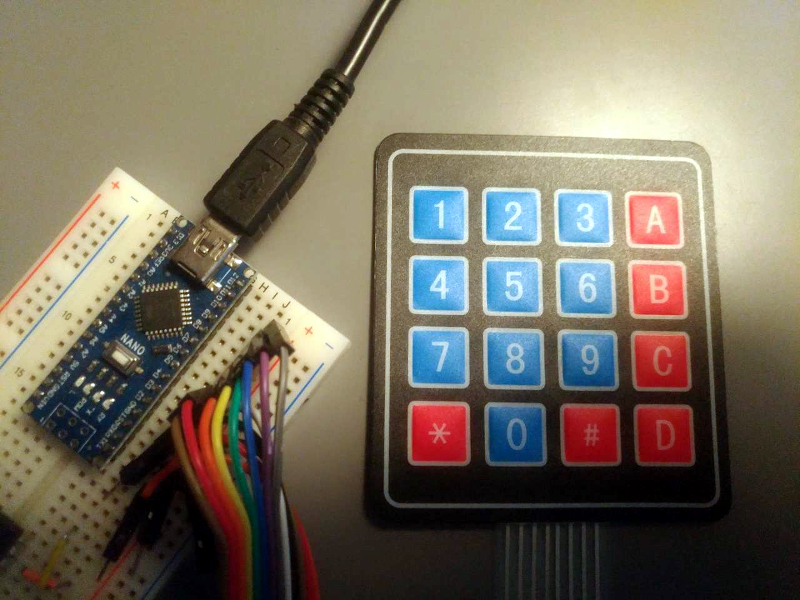

# Keypad pin finder
Find keypad pins using arduino

# Instructions

Connect your keypad to pins

Open serial console

Input keys list, or leave empty for default

Press keypad keys

Copy and paste the code!
